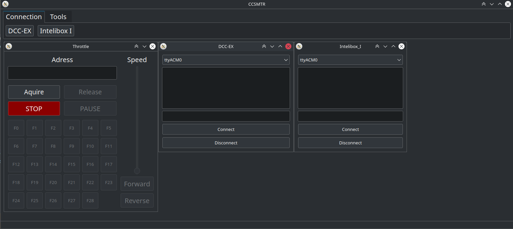

# CCSMTR - Computerized Control System for Model Train Railroads
Ahoj, toto je moj projekt na ovladanie modelovych vlakov (neskor aj celeho kolajiska)
Zatial co funguje:
- pomocou projektu DCC-EX je mozne cez serialovu linku ovladať lokomotivy.
- podpora cez wsl vo windowse
  Ciele:
  - ~~ovladanie lokomotiv s "DCC-EX"~~
      - ulozenie profilu lokomotiv
  - ovladanie lokomotiv s "Intelibox I"
      - komunikacia cez intellibox 1 (serial)
- samotne kolajisko:
  - navrhnutie kolajiska
    - dynamicky vytvarat kolajisko
    - ulozenie kolajiska

