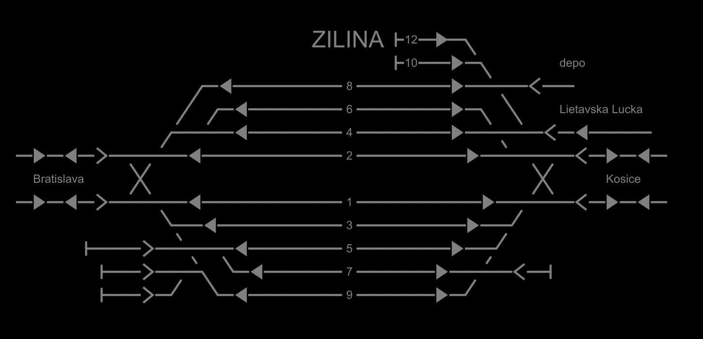

# CCSMTR - Computerized Control System for Model Train Railroads
Ahoj, toto je moj projekt na ovladanie digitalnych modelovych vlakov aj celeho kolajiska
\
Zatial co funguje:
- program je zatiaľ spustiteľny na distre Arch Linux [podpora cez wsl vo windowse (distro Arch Linux)]

- Co je hotove:
- - pomocou projektu DCC-EX je mozne ovladať lokomotivy (serialna komunikacia).
  - prestavovanie prestavníkov cez WD10-kuehn-digital viz poznamkyWD10.txt
  - docasne staticke kolajisko
  - nacitavanie cez xml suboru
  - dynamicky vytvarat kolajisko
- samotne kolajisko:
  - navrhnutie kolajiska
      - editovanie kolajiska
      - dynamicky spracovanie kolajiska
- Tento projekt je predovšetkym najprv zamerany na toto koľajisko:
  https://www.facebook.com/profile.php?id=61559042625592

